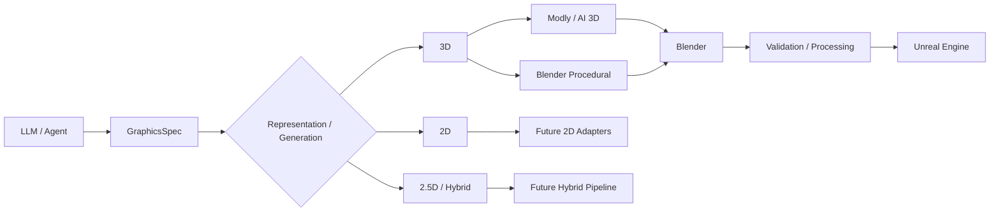

# Agentic Graphics

**Open workflows for agent-driven 2D, 2.5D, 3D, Blender, and real-time graphics pipelines.**

Agentic Graphics is an independent, provider-neutral open-source substrate for turning visual intent into inspectable graphics workflows. Version 0.1 starts with the parts that are implemented and testable today: machine-readable specifications, composable workflow stages, procedural Blender generation, Blender asset processing and validation, optional Modly automation or file handoff, and Unreal Engine ingestion.

It is not a continuation of CyberOffice or CyberIsland, and it contains none of their implementation, scenes, projects, models, or production assets.



## What is Agentic Graphics?

The project separates intent, orchestration, tool execution, artifacts, validation, and provenance:

```text
Agent → GraphicsSpec → Workflow Graph → Adapters / Stages
      → Artifacts → Validation → Output + Provenance
```

That separation matters. Modly is an optional generator, Blender is the first processing environment, and Unreal is the first real-time engine adapter; none is encoded as the permanent definition of the project.

## Philosophy

- **Provider-neutral agents.** Use a hand-authored spec, any external command, or an optional OpenAI-compatible HTTP provider.
- **Graphs, not one giant script.** Workflow nodes declare dependencies and are resolved as a DAG.
- **Evidence over optimistic status.** Unknown tool, model, license, or version values remain `UNKNOWN`; adapters do not invent a PASS.
- **Generated assets are replaceable.** Specs, hashes, reports, logs, manifests, and provenance are durable; generated media stays out of Git by default.
- **Explicit mutation.** Dry-run is side-effect-light. Generated Blender Python requires explicit execution approval by default. Optimizations run only when the spec requests them.
- **Open-ended representation.** The data model already admits `2d`, `2.5d`, `3d`, and `hybrid`, while 0.1 implements the mature 3D path only.

## Current capabilities

Implemented in 0.1 alpha:

- JSON Schema validation for `GraphicsSpec` v1;
- string or object workflow nodes with dependency resolution and cycle detection;
- manual, command, and optional OpenAI-compatible LLM adapters;
- manual mesh input, Modly local API automation with handoff fallback, and Blender procedural generation;
- procedural cube, crate, chair, and simple stylized prop fixtures made only from primitives;
- Blender background import, transform normalization, spec-controlled cleanup/decimation, GLB export, mesh/material/texture inspection, and JSON reports;
- Unreal Editor command-line Python import to a validated `/Game/...` path with a JSON report;
- isolated run directories, events, SHA-256 manifests, and representation-neutral provenance;
- cross-platform tool discovery, `doctor`, and safe dry-run;
- unit/contract tests that do not assume Blender, Unreal, or Modly exists on a CI runner.

Not implemented yet: production 2D/2.5D adapters, NPR shaders, a general parallel scheduler, a GUI, a cloud service, or an operating-system sandbox.

## Quick Start

Requires Python 3.9 or newer. Blender and Unreal are discovered only when a selected workflow needs them.

```bash
git clone https://github.com/Ka1y0/agentic-graphics.git
cd agentic-graphics
python3 -m venv .venv
source .venv/bin/activate        # Windows: .venv\Scripts\activate
python -m pip install -e .

agfx doctor
agfx run examples/crate.yaml --dry-run
agfx run examples/crate.yaml --approve-generated-code
```

The first command checks the schema, graph, adapter selection, tool discovery, expected inputs, and expected outputs. It does not call a paid model, run Blender, or modify an Unreal project.

To initialize a separate working directory:

```bash
agfx init ./my-graphics-workflow
```

Copy `agentic-graphics.example.toml` to `agentic-graphics.toml` for local overrides. Local config and all `runs/` content are ignored by Git.

## Architecture

The central abstractions are:

- `GraphicsSpec`: provider-neutral visual intent, representation, constraints, processing, output, and workflow;
- `Workflow` / `WorkflowNode`: a dependency graph resolved before execution;
- `Adapter`: an LLM, generator, processing, renderer, or engine boundary;
- `RunContext`: isolated paths, state, events, and execution configuration;
- `Artifact`: a typed file that becomes a manifest record;
- `ValidationResult`: explicit checks, warnings, errors, and status;
- `ProvenanceRecord`: reusable lineage for any representation.

See [architecture](docs/architecture.md), [workflows](docs/workflows.md), [adapters](docs/adapters.md), and [local integration evidence](docs/integration-testing.md).

## GraphicsSpec

The canonical schema is [`schemas/graphics-spec.schema.json`](schemas/graphics-spec.schema.json). A minimal procedural example:

```yaml
schema_version: "1"
project: {name: stylized_crate}
intent:
  description: Stylized realtime shipping crate made from primitives.
representation: {type: "3d"}
generation:
  adapter: blender_procedural
  license: CC0-1.0
  parameters: {shape: crate}
processing:
  blender:
    apply_transforms: true
    validate_mesh: true
output:
  adapter: local
  destination: processed.glb
workflow: [plan, generate, blender_process, validate]
```

The representation enum already includes `2d`, `2.5d`, `3d`, and `hybrid`. A future `render_style: {type: toon}` is valid data today, but no toon renderer is claimed in 0.1. See [GraphicsSpec](docs/graphics-spec.md).

## Blender workflow

`BlenderProceduralAdapter` copies a vetted generator into the dedicated run as `generated_blender_script.py`, scans it conservatively, and preserves it for review. Execution requires:

```bash
agfx generate examples/crate.yaml --approve-generated-code
```

Blender runs as:

```text
blender --background --factory-startup --python <run-script> -- <bounded arguments>
```

Processing never edits the source file in place. `apply_transforms`, `merge_by_distance`, `remove_degenerate`, and `decimate_ratio` are opt-in spec fields. Reports record requested and applied operations, before/after metrics, Blender version, warnings, and errors. See [Blender](docs/blender.md).

## Optional Modly workflow

Modly is not a dependency. The adapter prefers the installed application's documented loopback FastAPI interface when `/health` is reachable and a `generation.reference_image` exists. It starts a bounded image-to-3D job, polls status, and downloads the resulting workspace artifact.

If the service is unavailable or there is no automated input, `ModlyHandoffAdapter` writes:

```text
generated/modly-handoff/generation-request.json
```

The user or agent exports GLB/OBJ/STL/PLY, supplies it as `generation.source`, and the workflow continues into Blender. No nonexistent Modly CLI is fabricated. See [Modly](docs/modly.md).

## Unreal workflow

Point `output.unreal_project` at a disposable or project-owned `.uproject` with Epic's Python Editor Script Plugin enabled:

```yaml
output:
  adapter: unreal
  destination: /Game/Generated/stylized_crate
  unreal_project: /absolute/path/to/Fixture.uproject
workflow: [plan, generate, blender_process, validate, unreal_import]
```

The adapter invokes `UnrealEditor-Cmd` unattended, passes a bounded JSON job, imports the validated file through Unreal's editor API, saves only returned asset paths, and emits `unreal-import-report.json`. The repository includes no Unreal project, `.uasset`, engine binary, or marketplace asset. See [Unreal](docs/unreal.md).

## Runs, manifests, and provenance

Every non-dry run gets an ignored directory:

```text
runs/<run-id>/
├── request.yaml
├── resolved-spec.json
├── inputs/
├── generated/
├── processed/
├── outputs/
├── reports/
├── logs/
├── events.jsonl
├── manifest.json
└── provenance.json
```

The manifest records artifact size and SHA-256. Provenance records representation, source, generator, model, license, input/output hashes, Blender and engine versions, workflow version, and timestamp. Missing facts are `UNKNOWN`, never guessed. See [provenance](docs/provenance.md).

## Security

Generated Python is not executed during dry-run. Actual execution uses a dedicated run directory, an explicit CLI approval flag, no shell, a timeout, captured stdout/stderr, a preserved script, and a conservative AST check that rejects common shell/network/dynamic-code primitives.

This is **not an OS-level sandbox**. A reviewed Python process running inside Blender still has the current user's privileges. Use a VM/container or a restricted operating-system account when stronger isolation is required. Modly automation defaults to loopback only, secrets come from environment variables, and logs never include API keys. Read [security design](docs/security.md) and [the disclosure policy](SECURITY.md).

## Current limitations

- Only a small, vetted primitive grammar is implemented for procedural Blender generation; arbitrary free-form generated Python is intentionally not a default path.
- Blender, Unreal, and Modly integration tests are local/optional; CI validates commands and reports using mocks and fixtures.
- Unreal import behavior depends on installed engine plugins and file-format support. Materials are imported using engine defaults where reliable, not reconstructed by a custom shader translator.
- Modly's bundled local service is optional and unauthenticated loopback software. Do not expose it to a network.
- The graph resolver supports dependencies and topological ordering but does not yet execute branches in parallel.
- Visual quality approval remains human- or policy-driven; geometry validation is not art direction.

## Future 2D / 2.5D / NPR directions

The planned entry points are documented without fake adapters:

- [2D](docs/2d.md): image generators, procedural renderers, compositing, textures, sprites, UI assets, validation, and export;
- [2.5D](docs/2_5d.md): layers, depth, cards, billboards, sprites in 3D space, parallax, and camera validation;
- [NPR / 3D→2D appearance](docs/npr.md): toon/cel materials, outlines, orthographic stylization, limited-frame capture, and 3D-generated sprites.

## Contributing

Contributions should add a real interface, deterministic fixtures, dry-run behavior, structured reports, provenance fields, tests, and honest capability documentation. Start with [CONTRIBUTING.md](CONTRIBUTING.md).

## License and third-party attribution

Agentic Graphics repository code and documentation are licensed under the [MIT License](LICENSE). MIT applies only to this repository's own work.

Blender, Unreal Engine, Modly, external AI services, model weights, generated media, and third-party assets remain subject to their own licenses and terms. Agentic Graphics is not an official project of the Blender Foundation, Epic Games, Modly, OpenAI, Anthropic, Google, or xAI. No logos, proprietary code, licensed binaries, model weights, or third-party production assets are distributed here.
