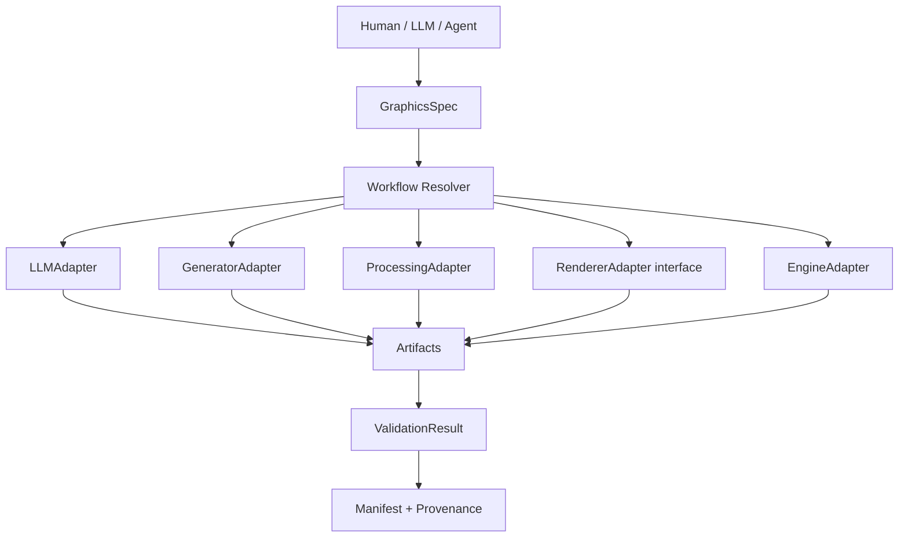

# Architecture

Agentic_Graphics treats graphics automation as a graph of bounded tool calls, not as a single vendor pipeline.



## Core contracts

`GraphicsSpec` is the canonical, representation-neutral request. `WorkflowNode` identifies a stage and its dependencies. `WorkflowResolver` performs deterministic topological ordering and rejects missing dependencies and cycles. `AdapterRegistry` resolves a stage to an implemented adapter by kind and name.

`RunContext` owns an isolated run root, resolved spec, artifact list, events, and transient state. `Artifact` turns a file into a content-addressed manifest record. `ValidationResult` carries a status plus checks, warnings, and errors. Provenance is generated independently of media type.

## V0.1 execution graph

The implemented path is:

```text
manual / command / OpenAI-compatible planning
  → manual file / Modly / Blender procedural generation
  → Blender processing
  → Blender validation
  → local output or Unreal import
```

2D, 2.5D, hybrid, renderer, and other engine adapters are architectural extension points only. The registry contains no placeholder implementation for them.

## Boundaries

- The core does not call a shell for adapter commands.
- An adapter receives a validated spec and writes only its run artifacts or an explicitly named external destination.
- Source assets are copied into run intake and are never optimized in place.
- The Unreal destination must remain below `/Game/` and is validated before launch and inside Unreal.
- Configuration resolution is explicit config → environment variable → known install locations → `PATH`.
