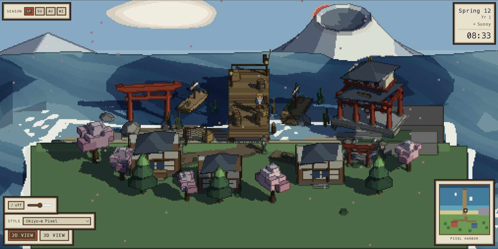
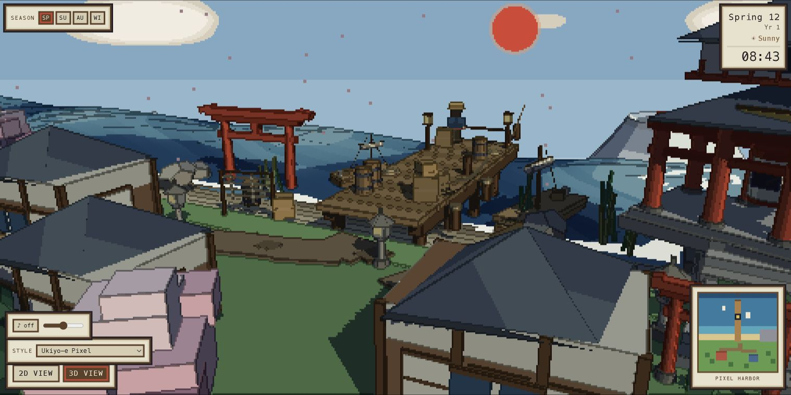
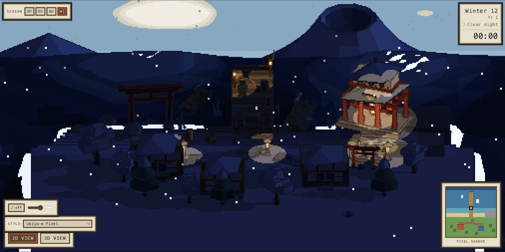
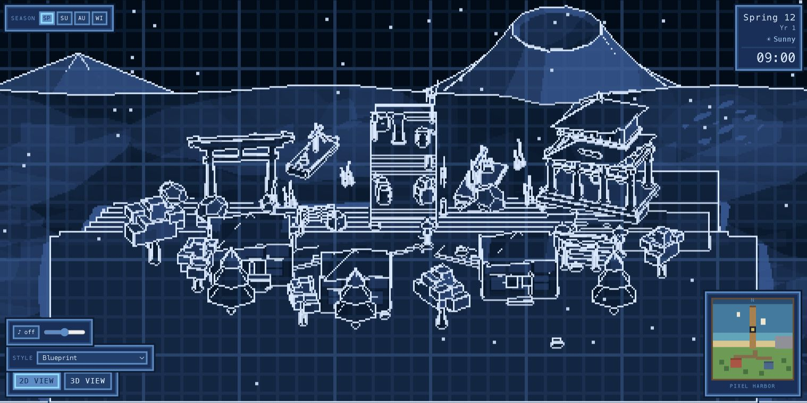
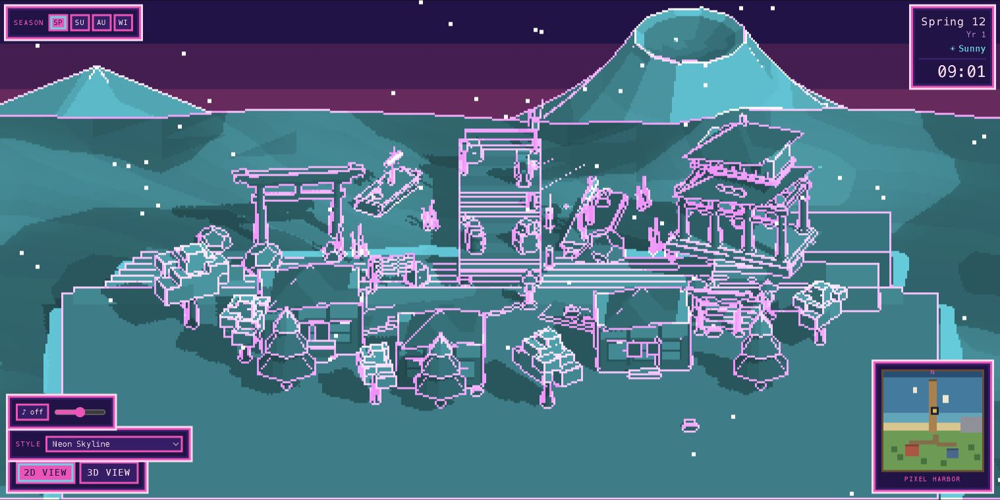

# Pixel Harbor

**A shared Three.js world rendered through multiple graphical realities.**



[Launch the live demo](https://ka1y0.github.io/Agentic_Graphics/pixel-harbor/) · [Read the technical case study](../../docs/showcases/pixel-harbor.md)

## What is Pixel Harbor?

Pixel Harbor is a standalone reference world developed through an agentic graphics workflow. It began as a Three.js 2.5D pixel-harbor experiment and grew through iterative human-agent creative direction, implementation, measurement, and visual QA.

It is not generated automatically by the Agentic_Graphics Python Core. Its role is to show that agentic graphics workflows can grow into complete interactive visual worlds while keeping implementation, renderer behavior, measurements, and limitations inspectable.

## Features

- Ukiyo-e Pixel, Cel-Shaded, Blueprint, Minimal Pencil, ASCII / CRT, and Neon / Vaporwave render styles;
- Spring, Summer, Autumn, and Winter world states;
- a shared day/night clock, giant Fuji, and symbolic red sun;
- NPC patrol, idle, and fishing behavior;
- lamps and house schedules at night;
- original procedural Japanese-inspired Web Audio with no samples or external audio files;
- a reversible 2D ↔ 3D reveal over the same world;
- deterministic cinematic direction and quantitative self-tests for developers.

## Gallery

| Canonical 3D exploration | Winter night |
|---|---|
|  |  |

| Blueprint | Neon / Vaporwave |
|---|---|
|  |  |

## One World, Many Realities

```text
WORLD != STYLE
```

The **world layer** owns geometry, water, Fuji, sun, boats, NPCs, clock, seasons, and behavior. The **style layer** owns palette, shading, outlines, post-processing, and HUD skin. Switching a style does not replace the world or reset its state.

## Renderer

The default pipeline is:

```text
low-resolution rasterization
↓
color + depth
↓
view-space normals
↓
depth / normal geometry edges
↓
hue-preserving colored outlines
↓
quantized lighting
↓
exact nearest-neighbor upscale
```

The pixel-art appearance does **not** begin with full-resolution 3D followed by a pixelation filter. Geometry is rasterized at low resolution, stylized at that resolution, and then enlarged by an exact integer scale. At a 1440×900 output in the default style, the measured internal resolution is 480×300 and the upscale is exactly 3×.

## Run locally

Requires Node.js 20.19+ (Node 22 LTS is used in CI).

```bash
git clone https://github.com/Ka1y0/Agentic_Graphics.git
cd Agentic_Graphics/worlds/pixel_harbor
npm ci
npm run dev
```

Build and preview the production output:

```bash
npm run build
npm run preview
```

## Public and debug modes

The normal [live demo](https://ka1y0.github.io/Agentic_Graphics/pixel-harbor/) shows the public world controls: season, style, audio, 2D/3D view, and date/time. Audio starts off and Web Audio is created only after a user gesture.

Append [`?debug=1`](https://ka1y0.github.io/Agentic_Graphics/pixel-harbor/?debug=1) to expose the shader controls, render buffers, diagnostics, self-test hooks, time controls, and the full developer panel. `H` toggles that panel only in debug mode.

## Canonical cameras

The initial 2D view is the canonical hero framing. The default settled 3D view is the canonical exploration distance. Public screenshots and initial state must not pull either camera farther away merely to show more map.

## Source and licensing

Pixel Harbor application code, shaders, procedural visual construction, and documentation are released under the repository [MIT License](../../LICENSE). Direct dependencies and their licenses are recorded in [THIRD_PARTY_NOTICES.md](THIRD_PARTY_NOTICES.md).

No showcase video, local reproducibility archive, Git bundle, capture scratch, `node_modules`, or built `dist` output is published in this directory.
